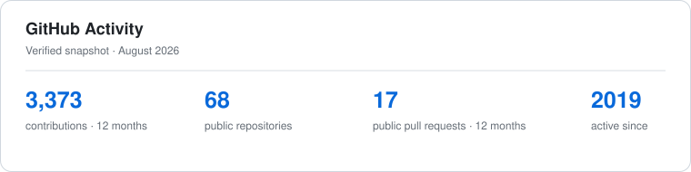

# Roman Chikhladze

### Senior Software Engineer · Distributed Systems · Platform Engineering

I design and deliver reliable software platforms with clear architecture,
strong operational foundations, and maintainable TypeScript systems.

## About me

- Senior Software Engineer at **syniotec**
- Focused on backend architecture, distributed workflows, APIs, and platform reliability
- Experienced in designing systems for security, observability, testability, and graceful failure
- Comfortable owning work from technical design through production delivery
- Based in **Georgia**

## Experience & education

| | |
|---|---|
| **Senior Software Engineer** | **syniotec** · Software architecture and production systems |
| **Caucasus University** | 2017–2021 |

## Technical toolkit

**Languages & foundations**

**Backend engineering**

_Runtimes & frameworks_

_Data access & validation_

_Integration & processing_

_Service foundations_

**APIs & real-time systems**

**Data, caching & messaging**

**Frontend engineering**

**Architecture & system design**

_Core architecture_

_Service & API design_

_Reliable workflows & messaging_

_Scalability & resilience_

**Cloud, infrastructure & delivery**

**Testing & code quality**

**Security, reliability & observability**

## Engineering principles

- Understand the problem before choosing the solution
- Build for meaningful outcomes, not technology for its own sake
- Prefer simple, clear designs with explicit trade-offs
- Take ownership from the first decision through the final result
- Optimize for long-term maintainability, not short-term cleverness
- Communicate decisions clearly and collaborate with respect
- Keep learning, challenge assumptions, and share knowledge

## GitHub analytics

<picture>
  <source media="(prefers-color-scheme: dark)" srcset="./assets/github-stats-dark.svg">
  <source media="(prefers-color-scheme: light)" srcset="./assets/github-stats-light.svg">
  
</picture>

---

**Building software that stays understandable, observable, and reliable in production.**

